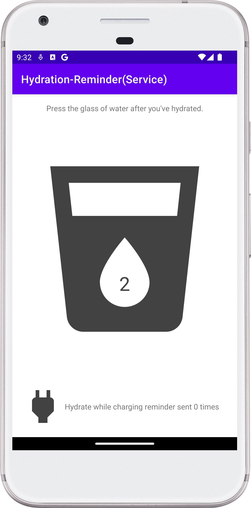

# Hydration Reminder Service

## Project Description

The Hydration Reminder Service is an Android mobile application designed to remind users to drink
water. The app features a single screen with a picture of a glass and a counter in the middle.
Above the glass, there is a text prompt: "Press the glass of water after you have hydrated." At
the bottom, the text "Hydrate while charging reminder sent 0 times" is displayed.

## Features

- **Main Screen**: Displays a picture of a glass with a counter. Users are prompted to press the
- glass after hydrating.
- **Water Count**: Keeps track of the number of times the user has hydrated.
- **Charging Reminder**: Sends reminders to hydrate while the device is charging.

## Installation Instructions

1. Download the project.
2. Open the project in Android Studio.
3. Run the project from Android Studio.

## Usage

Once installed, developers can observe a solid example of using a worker, intent service, and
shared preference listener. The app can be installed on an Android device and used as a hydration
reminder app. Note that the app is not unique and similar functionality can be found in many other
apps on Google Play. The primary usefulness of the project lies in its educational value,
demonstrating how to use the mentioned technologies.

## Technologies Used

- **Kotlin**: Programming language.
- **BroadcastReceiver**: For receiving system-wide broadcast announcements.
- **JobIntentService**: For handling background tasks.
- **kotlinx.coroutines**: For coroutine support.
- **androidx.preference:preference-ktx**: For preference support.
- **androidx.work:work-runtime-ktx**: For WorkManager support.
- Architectural pattern: [Monolith](https://en.wikipedia.org/wiki/Monolithic_application).
- **Code Readability:** code is easily readable with no unnecessary blank lines, no unused variables
  or methods, and no commented-out code, all variables, methods, and resource IDs are descriptively
  named such that another developer reading the code can easily understand their function.

## Contributing

Anyone can contribute by creating a pull request with changes. Contributions are welcome, although
the app currently does not have unique features that differentiate it from other hydration
reminder apps.

## Credits

This project may have been inspired by a tutorial from Google, but the specific tutorial is no
longer available.

## License

This project does not have an intentional license.

### Screenshot:

<!--suppress CheckImageSize -->

